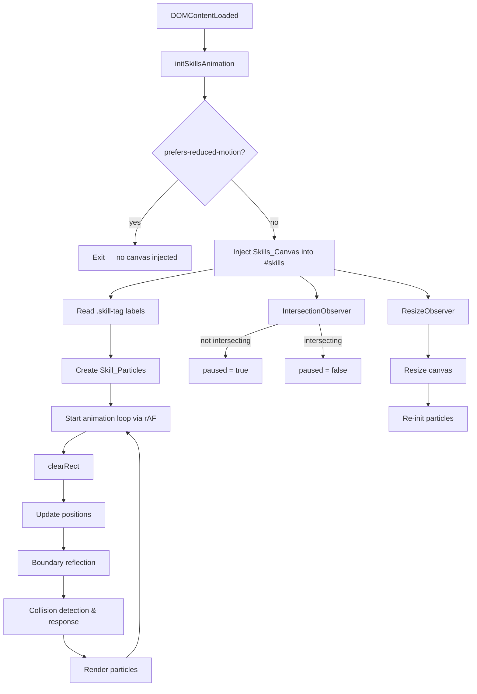

# Design Document: Skills Animation

## Overview

This feature adds an animated canvas background to the `#skills` section of the portfolio. Skill label text is extracted from the existing `.skill-tag` elements and rendered as freely-moving pill-shaped particles on a `<canvas>` that sits behind the section's existing content. Particles bounce off the canvas boundaries and off each other (billiard-ball-style velocity exchange). The animation pauses when the section leaves the viewport and respects the `prefers-reduced-motion` media query.

The implementation is a single vanilla-JavaScript module (`initSkillsAnimation`) added to `js/main.js` and called from the existing `DOMContentLoaded` handler. No new dependencies are required. A small block of CSS is added to `css/style.css` to position the canvas correctly and ensure z-index layering.

### Key Design Decisions

- **Canvas-only rendering**: All animation is drawn on a `<canvas>` element. No DOM elements are moved, keeping layout reflows to zero during animation.
- **Axis-aligned bounding-box (AABB) collision**: Particles are treated as rectangles for both boundary reflection and inter-particle collision. This matches the pill shape visually and is cheap to compute.
- **Velocity exchange on collision**: When two particles overlap, their full velocity vectors are swapped. This is a simplified elastic-collision model that is visually convincing and easy to reason about.
- **IntersectionObserver for pause/resume**: Mirrors the pattern already used by `initParticles` and `initBinaryRain` in the codebase.
- **ResizeObserver for canvas resize**: Also mirrors the existing pattern; re-initialises all particle positions and velocities after resize to prevent out-of-bounds stranding.
- **fast-check for property tests**: The project already has `fast-check` as a dev dependency (used in `tests/validation.test.js`). The same library will be used for property-based tests for this feature.

---

## Architecture

The feature is self-contained within `initSkillsAnimation`. It follows the same structural pattern as `initParticles` and `initBinaryRain`:

```
DOMContentLoaded
  └── initSkillsAnimation()
        ├── Reduced-motion guard (exits early if prefers-reduced-motion: reduce)
        ├── Canvas injection & CSS setup
        ├── Particle initialisation (reads .skill-tag text, creates Particle objects)
        ├── Animation loop (requestAnimationFrame)
        │     ├── clearRect
        │     ├── update positions
        │     ├── boundary reflection
        │     ├── collision detection & response
        │     └── render particles
        ├── IntersectionObserver (pause / resume)
        └── ResizeObserver (resize canvas + re-init particles)
```

The module exposes no public API; it is entirely side-effect-driven.

### Mermaid Diagram



---

## Components and Interfaces

### `initSkillsAnimation()` — public entry point

Called once from `DOMContentLoaded`. Orchestrates all sub-components.

```js
/**
 * Initialise the skills section animated canvas background.
 * Exits immediately if prefers-reduced-motion: reduce is set.
 */
function initSkillsAnimation() { ... }
```

### `createParticle(label, x, y, vx, vy, width, height)` — particle factory

Returns a plain object representing one skill label particle.

```js
/**
 * @typedef {Object} Particle
 * @property {string} label   - Skill text (e.g. "Python")
 * @property {number} x       - Left edge position (px)
 * @property {number} y       - Top edge position (px)
 * @property {number} vx      - Horizontal velocity (px/frame)
 * @property {number} vy      - Vertical velocity (px/frame)
 * @property {number} width   - Bounding box width (px)
 * @property {number} height  - Bounding box height (px)
 */
```

### `measureParticle(ctx, label)` — text measurement

Uses `ctx.measureText` to compute the rendered width of a label, then adds padding to produce the bounding box dimensions.

```js
/**
 * @param {CanvasRenderingContext2D} ctx
 * @param {string} label
 * @returns {{ width: number, height: number }}
 */
function measureParticle(ctx, label) { ... }
```

### `initParticles(ctx, canvasWidth, canvasHeight, labels)` — particle list factory

Creates one `Particle` per label, placed at a random fully-visible position with a random velocity.

```js
/**
 * @param {CanvasRenderingContext2D} ctx
 * @param {number} canvasWidth
 * @param {number} canvasHeight
 * @param {string[]} labels
 * @returns {Particle[]}
 */
function initParticles(ctx, canvasWidth, canvasHeight, labels) { ... }
```

### `updateParticles(particles, canvasWidth, canvasHeight)` — physics step

Moves each particle, applies boundary reflection, then resolves all pairwise collisions.

```js
/**
 * @param {Particle[]} particles
 * @param {number} canvasWidth
 * @param {number} canvasHeight
 */
function updateParticles(particles, canvasWidth, canvasHeight) { ... }
```

### `reflectBoundaries(particle, canvasWidth, canvasHeight)` — boundary logic

Negates the appropriate velocity component and clamps position when a particle reaches a boundary.

```js
/**
 * @param {Particle} particle
 * @param {number} canvasWidth
 * @param {number} canvasHeight
 */
function reflectBoundaries(particle, canvasWidth, canvasHeight) { ... }
```

### `resolveCollisions(particles)` — collision detection and response

O(n²) pairwise AABB overlap check. On overlap: swap velocity vectors, then separate the pair along the axis of minimum overlap.

```js
/**
 * @param {Particle[]} particles
 */
function resolveCollisions(particles) { ... }
```

### `renderParticles(ctx, particles)` — drawing

Clears the canvas and draws each particle as a pill-shaped label matching the `.skill-tag` visual style.

```js
/**
 * @param {CanvasRenderingContext2D} ctx
 * @param {Particle[]} particles
 */
function renderParticles(ctx, particles) { ... }
```

---

## Data Models

### Particle

```js
{
  label:  string,   // skill text, e.g. "TensorFlow"
  x:      number,   // left edge of bounding box (px from canvas left)
  y:      number,   // top edge of bounding box (px from canvas top)
  vx:     number,   // horizontal velocity (px per animation frame, signed)
  vy:     number,   // vertical velocity (px per animation frame, signed)
  width:  number,   // bounding box width (px) — computed from label text + padding
  height: number,   // bounding box height (px) — fixed pill height
}
```

### Animation State (module-level variables inside `initSkillsAnimation`)

| Variable | Type | Description |
|---|---|---|
| `canvas` | `HTMLCanvasElement` | The injected Skills_Canvas |
| `ctx` | `CanvasRenderingContext2D` | 2D rendering context |
| `particles` | `Particle[]` | Live list of all skill particles |
| `paused` | `boolean` | Whether the animation loop is paused |
| `animFrameId` | `number` | Current `requestAnimationFrame` handle |

### Visual Constants

| Constant | Value | Source |
|---|---|---|
| `FONT` | `'500 0.875rem "Segoe UI", system-ui, sans-serif'` | Matches `.skill-tag` font |
| `PADDING_X` | `12` px | Matches `var(--space-3)` (0.75rem at 16px base) |
| `PADDING_Y` | `4` px | Matches `var(--space-1)` (0.25rem at 16px base) |
| `BORDER_RADIUS` | `9999` px | `var(--radius-full)` — full pill |
| `TEXT_COLOR` | `'#66dfff'` | `var(--color-primary-light)` |
| `BG_COLOR` | `'rgba(0, 200, 255, 0.08)'` | Matches `.skill-tag` background |
| `BORDER_COLOR` | `'rgba(0, 200, 255, 0.25)'` | Matches `.skill-tag` border (`--color-border-accent`) |
| `MIN_SPEED` | `0.5` px/frame | Per Requirement 2.3 |
| `MAX_SPEED` | `1.5` px/frame | Per Requirement 2.3 |

### CSS additions to `style.css`

```css
/* Skills section canvas background */
#skills {
  position: relative;
  overflow: hidden;
}

#skills-canvas {
  position: absolute;
  inset: 0;
  width: 100%;
  height: 100%;
  z-index: 0;
  pointer-events: none;
}

#skills > .container {
  position: relative;
  z-index: 1;
}
```

---

## Correctness Properties

*A property is a characteristic or behavior that should hold true across all valid executions of a system — essentially, a formal statement about what the system should do. Properties serve as the bridge between human-readable specifications and machine-verifiable correctness guarantees.*

### Property 1: Particles are initialised fully within canvas bounds

*For any* canvas dimensions (width and height) and any non-empty array of skill labels, every particle produced by `initParticles` shall have its bounding rectangle fully contained within the canvas — i.e. `x >= 0`, `y >= 0`, `x + width <= canvasWidth`, `y + height <= canvasHeight`. This property covers both initial placement and post-resize re-initialisation, since both call the same `initParticles` function.

**Validates: Requirements 2.2, 1.5**

### Property 2: Particle speed is within the specified range

*For any* canvas dimensions and any non-empty array of skill labels, every particle produced by `initParticles` shall have a speed (Euclidean magnitude of its velocity vector, `Math.hypot(vx, vy)`) in the closed interval [0.5, 1.5] px/frame.

**Validates: Requirements 2.3**

### Property 3: One particle is created per unique label

*For any* array of skill label strings (which may contain duplicates), `initParticles` shall return exactly as many particles as there are unique labels in the input array.

**Validates: Requirements 2.1**

### Property 4: Position update adds velocity to position

*For any* particle with position `(x, y)` and velocity `(vx, vy)`, after one call to the position-update step the particle's position shall be `(x + vx, y + vy)`.

**Validates: Requirements 3.1**

### Property 5: Boundary reflection keeps particles in bounds

*For any* particle (regardless of whether its initial position is inside or outside the canvas) and any canvas dimensions, after applying `reflectBoundaries` the particle's bounding rectangle shall be fully contained within the canvas bounds.

**Validates: Requirements 4.3**

### Property 6: Boundary reflection negates the correct velocity component

*For any* particle whose bounding rectangle crosses or touches the left or right boundary, after `reflectBoundaries` the horizontal velocity `vx` shall have the opposite sign to its pre-call value. Equivalently, for a particle crossing the top or bottom boundary, `vy` shall be negated. A particle that does not cross any boundary shall have its velocity unchanged.

**Validates: Requirements 4.1, 4.2**

### Property 7: After collision resolution, no two particles overlap

*For any* list of particles (including configurations where bounding rectangles initially overlap), after `resolveCollisions` no two particles shall have overlapping axis-aligned bounding rectangles.

**Validates: Requirements 5.2**

### Property 8: Collision resolution performs a velocity exchange

*For any* two particles whose bounding rectangles overlap, after `resolveCollisions` particle A's velocity shall equal particle B's pre-call velocity, and particle B's velocity shall equal particle A's pre-call velocity.

**Validates: Requirements 5.1**

> **Note on Properties 5 & 6**: Both test `reflectBoundaries` but verify different invariants. Property 5 checks the positional clamp (particle ends up inside bounds), while Property 6 checks the velocity sign flip. A correct position clamp with a wrong velocity sign would pass Property 5 but fail Property 6 — so both are necessary and non-redundant.

---

## Error Handling

| Scenario | Handling |
|---|---|
| `#skills` section not found in DOM | `initSkillsAnimation` returns early without throwing |
| No `.skill-tag` elements found | Function returns early; no canvas is injected |
| `getContext('2d')` returns null | Function returns early |
| `IntersectionObserver` not available | Animation runs continuously (Requirement 6.4) |
| `ResizeObserver` not available | Falls back to `window.addEventListener('resize', ...)` |
| `prefers-reduced-motion: reduce` | Canvas is not injected; function returns early (Requirements 7.1, 7.2) |
| `prefers-reduced-motion` media query not supported | Animation proceeds normally (Requirement 7.3) |
| Canvas width or height is zero after resize | Particles are not re-initialised (guard against division-by-zero in placement logic) |

---

## Testing Strategy

### Unit / Example-Based Tests

These cover specific scenarios and edge cases:

- Canvas is injected as the first child of `#skills` with `aria-hidden="true"`.
- Canvas is **not** injected when `prefers-reduced-motion: reduce` is active.
- `measureParticle` returns positive, non-zero dimensions for any non-empty label.
- `initParticles` returns exactly one particle per unique label.
- `reflectBoundaries` correctly handles a particle that is exactly on the boundary (edge case: position equals boundary).
- `resolveCollisions` is a no-op when no particles overlap.
- `resolveCollisions` handles a single pair of overlapping particles correctly.

### Property-Based Tests (fast-check)

The project already uses `fast-check` (v3.23.2). Property tests will be added to a new file `tests/skills-animation.test.js` and run with `node tests/skills-animation.test.js`.

Each property test runs a minimum of 100 iterations.

**Property 1 — Particles initialised in bounds**
Tag: `Feature: skills-animation, Property 1: particles initialised fully within canvas bounds`
Generate: random canvas dimensions (width 200–2000, height 200–1500), random label arrays (1–40 labels, each 1–20 chars). Assert every particle satisfies `x >= 0 && y >= 0 && x + width <= canvasWidth && y + height <= canvasHeight`.

**Property 2 — Particle speed in range**
Tag: `Feature: skills-animation, Property 2: particle speed within specified range`
Generate: same inputs as Property 1. Assert `Math.hypot(p.vx, p.vy)` is in `[0.5, 1.5]` for every particle.

**Property 3 — One particle per unique label**
Tag: `Feature: skills-animation, Property 3: one particle per unique label`
Generate: random arrays of label strings (1–50 labels, may contain duplicates). Assert particle count equals `new Set(labels).size`.

**Property 4 — Position update adds velocity to position**
Tag: `Feature: skills-animation, Property 4: position update adds velocity to position`
Generate: random particle with arbitrary position and velocity. Assert that after one update step `newX === oldX + vx` and `newY === oldY + vy`.

**Property 5 — Boundary reflection keeps particles in bounds**
Tag: `Feature: skills-animation, Property 5: boundary reflection keeps particles in bounds`
Generate: random canvas dimensions, random particle (position may be out of bounds to simulate a crossing event). Assert that after `reflectBoundaries` the particle is fully within bounds.

**Property 6 — Boundary reflection negates correct velocity component**
Tag: `Feature: skills-animation, Property 6: boundary reflection negates correct velocity component`
Generate: particles placed at or beyond each of the four boundaries with known velocities. Assert the perpendicular velocity component is negated; the parallel component is unchanged.

**Property 7 — No overlap after collision resolution**
Tag: `Feature: skills-animation, Property 7: after collision resolution no two particles overlap`
Generate: random lists of particles (positions may overlap). Assert that after `resolveCollisions` no two particles have overlapping AABBs.

**Property 8 — Velocity exchange on collision**
Tag: `Feature: skills-animation, Property 8: collision resolution performs velocity exchange`
Generate: two particles that are guaranteed to overlap. Record velocities before. Assert velocities are swapped after `resolveCollisions`.
